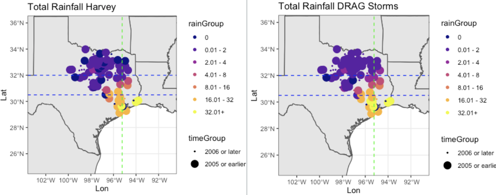
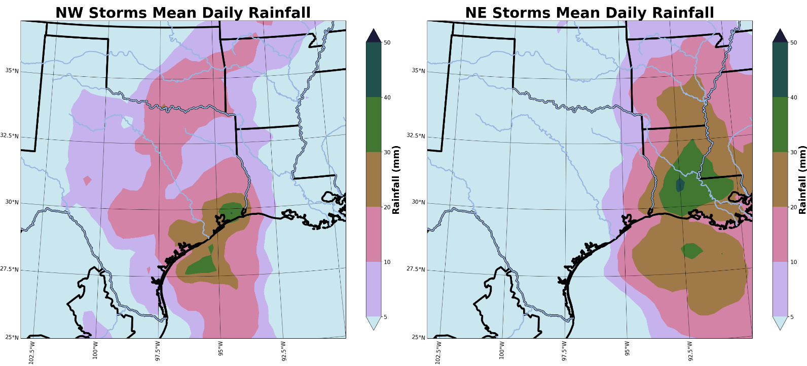
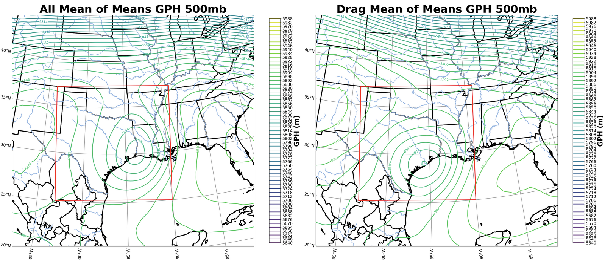
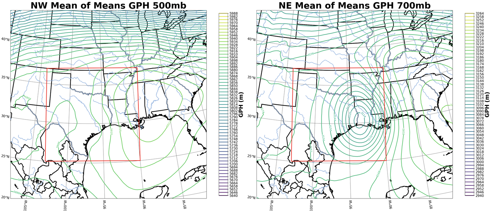

# Introduction - How Can We Best Determine the Flooding Impact of Hurricanes?

This notebook discusses visualizations produced in Python and R, and how they contributed to our understanding of hurricane rainfall over three East Texas rivers (the Brazos, Trinity, and Neches). Our goal is to determine if the tracks hurricanes take through the region might be able to predict river flooding risk. As described in the README LINK!!!!!!! we split hurrices into three groups based on track: NE, NW, drag.

This notebook serves as a sample of how I approached an exploritory data-based project. The plots shown in this notebook are a small fraction of the hundreds of plots I created. If you are interested in how the datasets used to make these plots were processed, or how the plots themselves were coded, see the previous notebook (01_data_processing).

# Hurricane Harvey, a Cautionary Tale 

When analyzing flooding risk, a good first step is probably to check how much it rained. The plot at the top of this notebook does just that! By summing up the rainfall from all hurricanes, we see that the heaviest hurricane rains in our sample fell along the coast... makes sense right?

In this case, as shown in the Measuring Rainfall section below, the overall behavior is more complex than this simple assessment.

This set of plots, made in R, demonstrate one reason we need to be cautious: outliers. Hurricane Harvey is just one of four storms in the drag category, but it's catastrophic flooding rains dominate the competition - Harvey dropped nearly all of the total rainfall of all storms in the drag category.

As we move on to trying to determine which types of storm track might cause the worst flooding, we need to be wary that our somewhat modest sample of 19 hurricanes will be dominated by outliers.

# Measuring Rainfall

When dealing with outliers like Harvey, and small sample sizes in general, it is best to approach the problem from a variety of angles. To this end, for each of the storm track groups we investigated total rainfall, average rainfall per hurricane, average daily rainfall, counts of hours with heavy rainfall, and more for every group. Each analysis has its advantages and disadvantages.

In this showcase, I will discuss the average daily total rainfall plots, made in Python.

*Plots showing mean daily rainfall for all hurricanes (top left) and for each other primary track group (other three plots).*

These plots compute their values by summing the rainfall on each full day in the sample with a hurricane present somewhere over the river basin, then averaging the results. This particular metric will favor storms such as Harvey that linger in the area a long time will be overrepresented, while fast-moving storms are underrepresented.

That said, we can still draw interesting conclusions, especially when comparing the NW and NE storms. These plots pretty distinctly show that storms whose centers track east of Houston produce less rainy days over the majority of the area. Meanwhile, NW storms seem to drop heavier rains both along the Texas coast and upstream over the upper portions of the three rivers of interest. Combined, this would imply that storms passing though western Texas might pose a higher flooding risk to eastern Texas than storms whose centers track through eastern Texas.

Taking all the variations of these plots into consideration, we found that as a group the storms produce rain over areas that are roughly consistent with their category definitions. The NE storms overall produced the most rain (unsurprising given that they are most numerous) but also had the highest frequency of heavier rainfall. But this rainfall is directed primarily away from the area in Louisiana. Meanwhile, the NW storms directly hit the entire area with lighter rain and the drag storms either produce substantial amounts of heavy rain along the coast or small amounts of light rain over the entire area depending on if you include Harvey or not.

# Geopotential Height

Since these groups have such clear differences in flooding impacts, it raises questions of if there is a way to better anticipate in advance which track a storm will take, and what group it will fall under.

To explore this question, we looked at several other variables besides raw rainfall data, including evaporation rates, a measure of atmospheric water content called precipitable water, and more.

Here I will discuss a variable called geopotential height, a way of understanding air pressure. As you go up in the atmosphere, the air pressure generally drops from surface pressure until it reaches 0 at the edge of atmosphere. This means, at some altitude, any given pressure between surface pressure and 0 is reached. Geopotential Height, for a given pressure value, is the altitude at which the pressure is achieved at a given point. 

Around the 500mb and 700mb levels, Geopotential Height effectively shows the direction (along the contours) and strength (tighter lines are stronger) of winds at the levels of the atmosphere that “carry along” disturbances like hurricanes, thus influencing their path. Darker colors on the plot indicate lower heights, and likely lower pressures overall.

All of these plots use a mean of means analysis, which is computed by taking the average of each hurricane separately, before averaging the results. This approach treats all hurricanes equally, regardless of impactful they may have actually been in the area of interest, quite the opposite of the daily rainfall plots above. 

All three groups feature horizontal lines packed tightly together in the north, signifying an intense west to east flow. They also feature a high pressure region roughly over Florida and a another to the west over New Mexico.

For NW storms, the high is further west and the northern flow extends further south over Kansas. This leaves a gap with weak flow over Texas, contributing to the slower movement of NW storms. They are gently pulled into western Texas from the remaining weak flow caused by the shifted eastern high. In the NE case, by contrast the eastern high is shifted more eastward and is stronger. Storms are pulled to the east at a fast pace.

For drag storms, even now notably biased by Harvey, the west to east flow is bent southwards. The western and eastern highs come closer together than for NW and NE storms as well, creating a pronounced area with almost no flow over Oklahmoma, elading to meandering behavior along coastal Texas as no strong flow exists to launch the storm northward.

The flow in the north is a constant presence in all of the plots but seems to drop south for NW and drag storms, locking off the northward pull from the eastern high in each case. It is hard to determine whether the changes in the high and the changes in the northern flow are caused by each other or other outside causes, but either way this interaction seems to be the key to determining which path storms take. The path determines group placement, and group placement ties back to placement of the heaviest rain for flooding considerations, leading this to be considered a variable to consider more strongly as hurricanes approach the Gulf Coast.